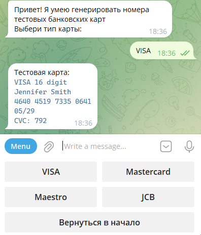
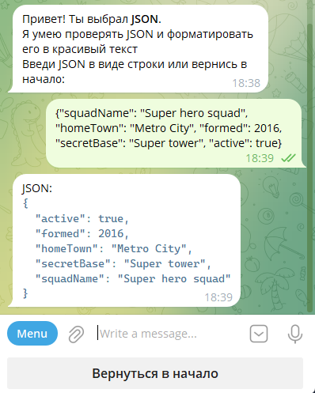
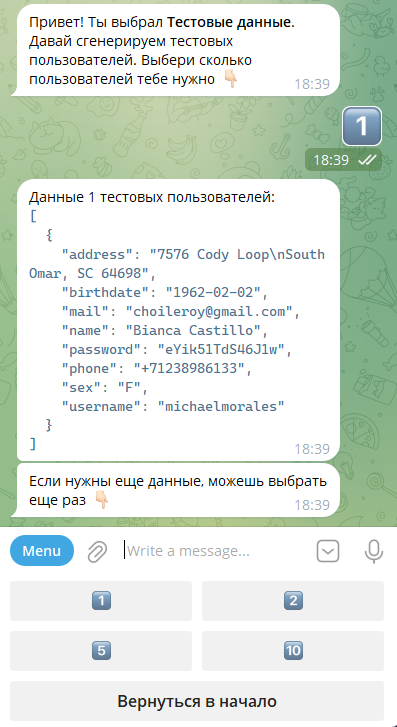
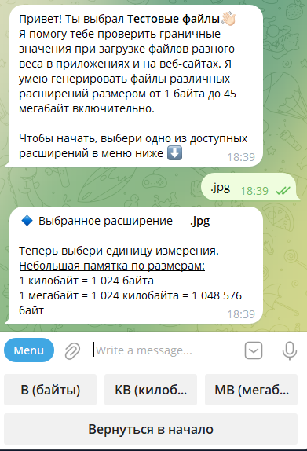

# QA helper
Bot-помощник для тестировщика.
Для запуска бота:
1. Создать файл .env
2. Сохранить в файле токен, заранее полученный в Telegram
   ```
   TOKEN=you_token
   ```

## Telegram-bot содержит четыре функционала:  

1. <ins>**Генерация тестовых данных кредитных карт (VISA, Mastercard, Maestro, JCB)**</ins>



2. <ins>**Проверка JSON-файлов**</ins>  



3. <ins>**Генерация тестовых данных**</ins>



4. <ins>**Генерация тестовых файлов**</ins>


